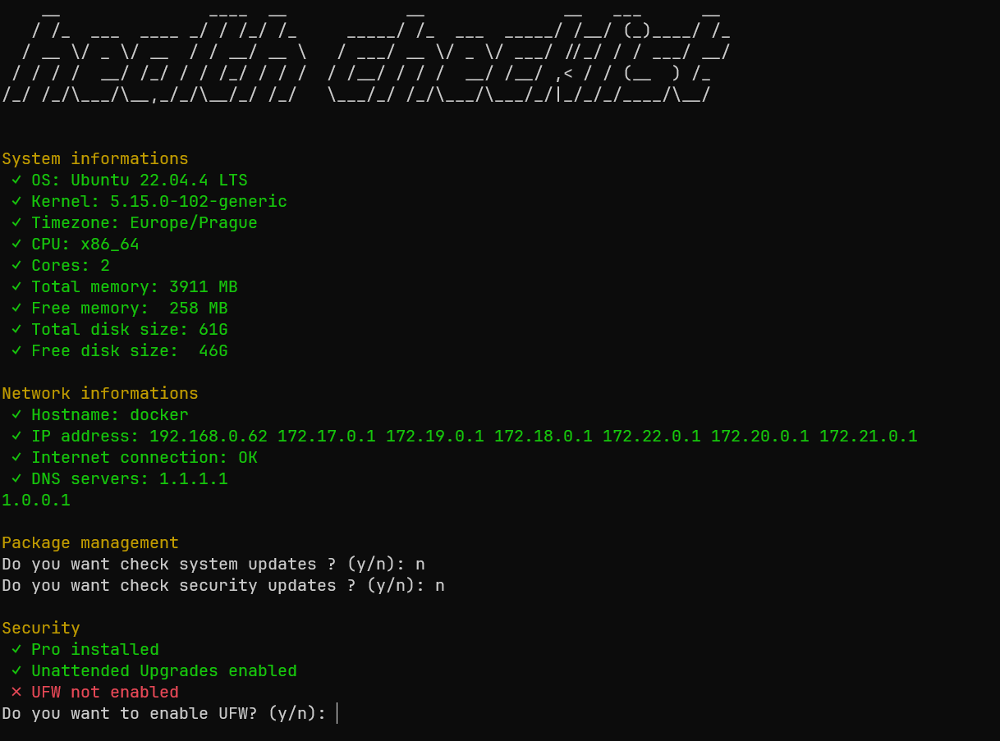

# Linux Health Checklist ✔️

Application that checks the health of a debian based linux servers.

The best way how to keep your server healthy is to check it regularly. This application will help you to check the most important configurations of your server. Keep your server up to date and secure.

**Have you HomeLab? This application is for you!**



## 🖥️ Requirements

### Required
- Debian based linux server with apt package manager
- Root access to the server (or sudo access)
- Bash

### Optional
- Wget
- SSH access to the server

## ⚠️ Warning

When the application wants to change some configurations of the server, it will ask you for confirmation. But be careful!

You can lose access to your server if you don't know what you are doing. This application can change some configurations of your server etc. SSH port, firewall rules, etc.

## 🏃 How to use?

The simplest way to use this application is to run the following command in the terminal of the server you want to check.

### Check only

If you want to run the application in dry-run mode, you can use the following command. The application only show current status of the server. It doesn't ask you for any improvements and doesn't change any configurations.

```bash
bash -c "$(wget -qLO - https://raw.githubusercontent.com/eduardstula/linux-health-checklist/master/health-checklist.sh)" -- --dry-run
```

### Check and improve

This command run application in standard mode. The application ask you for some improvements of the server. You can choose which improvements you want to apply.

```bash
bash -c "$(wget -qLO - https://raw.githubusercontent.com/eduardstula/linux-health-checklist/master/health-checklist.sh)"
```

### Why use this online command?
This command will download the latest version of the application from the repository and run it. You don't need to download the script manually and you can be sure that you are using the latest version of the application.

### Install the application on the server

If you want to install the application manually, you can download the script from the repository and run it.

```bash
wget https://raw.githubusercontent.com/eduardstula/linux-health-checklist/master/health-checklist.sh
chmod +x health-checklist.sh
./health-checklist.sh
```

## 🚩 Application flags

- `--dry-run` or `-d` - Run the application in dry-run mode. The application only show current status of the server. It doesn't ask you for any improvements and doesn't change any configurations.
- `--help` or `-h` - Show help message.

## 📋 Features

Table of features that the application checks:

### System informations

| Feature | Type | Description |
| --- | --- | --- |
| Os version | Show | Shows the version of the operating system |
| Kernel version | Show | Shows the version of the kernel |
| Timezone | Show | Shows the timezone of the server |
| CPU platform | Show | Shows the platform of the CPU |
| CPU cores | Show | Shows the number of CPU cores |
| Total memory | Show | Shows the total memory of the server |
| Free memory | Show | Shows the free memory of the server |
| Total disk space | Show | Shows the total disk space of the server |
| Free disk space | Show | Shows the free disk space of the server |


### Network informations

| Feature | Type | Description |
| --- | --- | --- |
| Hostname | Show | Shows the hostname of the server |
| Local IP | Show | Shows the local IP address of the server |
| Internet | Check | Check if the server has an internet connection |
| DNS server | Show | Shows the DNS server of the server |

### Package management

| Feature | Type | Description |
| --- | --- | --- |
| Update packages | Check | Check if there are any updates available |
| Security updates | Check | Check if there are any security updates available |

### Security

| Feature | Type | Description |
| --- | --- | --- |
| Ubuntu Pro | Check | Check if the server is using Ubuntu Pro if the server is running Ubuntu |
| Unnatended upgrades | Check | Check if the unattended-upgrades package is installed |
| Firewall | Check | Check if the UFW firewall is enabled |
| Fail2ban | Check | Check if the Fail2ban is installed and enabled |
| SSH port | Check | Check the SSH port of the server |
| SSH root login | Check | Check if the root login is enabled in SSH |
| SSH password authentication | Check | Check if the password authentication is enabled in SSH |
| Empty password | Check | Check if there are any users with an empty password |
| SSH keys | Check | Check if there are any SSH keys in the authorized_keys file |
| SSH nopasswd | Check | Check if there are any users with the NOPASSWD option in the sudoers file |

### Monitoring

| Feature | Type | Description |
| --- | --- | --- |
| Uptime | Show | Shows the uptime of the server |
| Load average | Show | Shows the load average of the server |
| Zabbix agent | Check | Check if the Zabbix agent is installed and running |

## 📖 Story

I created this application because I wanted to have a simple tool that will help me to check the health of my servers. I have a few servers in my HomeLab and I wanted to have a simple tool that will help me to check the most important configurations of the servers.

## 🫂 Contributing

If you want to contribute to this project, you can create a pull request with your changes. I will be happy to review and merge them.

## 🧪 Tested on

- Debian 12
- Raspbian 12
- Ubuntu 22.04

## 😶 Disclaimer

This application is not intended to be used in production environments. It is a simple script that shows and checks some basic configurations of a linux server.

This application ist not auditing tool. Only checks the most important configurations of the server.

Use it at your own risk. I am not responsible for any damage caused by this application.

## 📒 License

This project is licensed under the MIT License - see the [LICENSE.md](LICENSE.md) file for details.